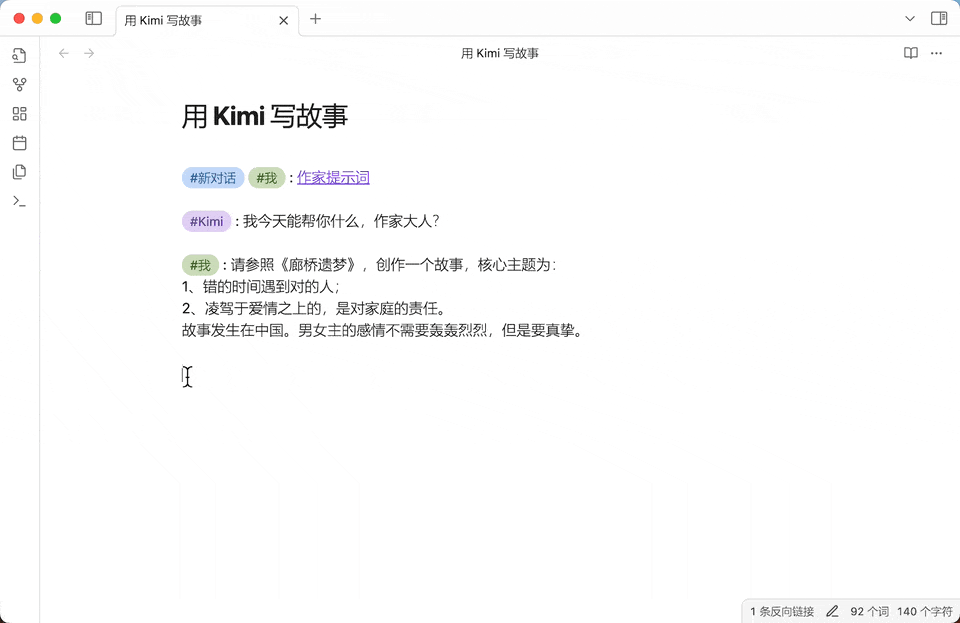

<h4 align="center">
	<p>
		<a href="https://github.com/TarsLab/obsidian-tars/blob/main/README_en.md">English</a> |
			<b>中文</b>
	<p>
</h4>

# 简介

Tars 是一个 Obsidian 插件，基于标签建议进行文本生成，支持 Claude、OpenAI、Gemini、Ollama、Kimi、豆包、阿里千问、智谱、深度求索、百度千帆等。Tars 这个名字来源于电影《星际穿越》中的机器人 Tars。

## 特性

- 通过标签触发，AI 助手生成文本



> ⚠️ **注意**：前面不要加“#”。是输入“标签”触发，而不是输入“#标签”。如上图输入的是“kimi”，而不是“#kimi”。

- 支持内部链接


- 将对话导出为 JSONL 数据集，支持 [ms-swift（Scalable lightWeight Infrastructure for Fine-Tuning）](https://github.com/modelscope/swift)

## AI 服务提供商

- [Azure OpenAI](https://azure.microsoft.com)
- [Claude](https://claude.ai)
- [DeepSeek 深度求索](https://www.deepseek.com)
- [Doubao 豆包](https://www.volcengine.com/product/doubao)
- [Gemini](https://gemini.google.com)
- [Kimi](https://www.moonshot.cn)
- [Ollama](https://www.ollama.com)
- [OpenAI](https://platform.openai.com/api-keys)
- [Qianfan 百度千帆](https://qianfan.cloud.baidu.com)
- [Qwen 阿里千问](https://dashscope.console.aliyun.com)
- [Zhipu 智谱](https://open.bigmodel.cn/)

如果上面列表没有你想要的 AI 服务提供商，可以在 issue 中提出具体方案。

### 助手特色

- DeepSeek：推理模型 deepseek-reasoner 的思维链以 callout 格式输出
- Zhipu：网络搜索选项

## 如何使用

在设置页面添加一个 AI 助手，设置 API 密钥，然后在编辑器中使用相应的标签来触发 AI 助手。通过对话形式来触发，先有用户消息，然后才能触发 AI 助手回答问题。

```text
#我 : 1+1=?（用户消息）
(隔开一个空行)
#Claude : （触发）
```

如果觉得 AI 助手回答不满意，想要重试。使用插件命令“选择光标处的消息”，选中 AI 助手的回答内容进行删除，修改下你的提问，再次触发 AI 助手。

如果在设置页面的 AI 助手中没有你想要的 model 类型，或者服务器地址需要自定义，可以在设置中的“覆盖输入参数”进行配置，输入 JSON 格式，例如 `{"model":"你想要的model", "baseURL": "自定义地址"}`。

## 对话语法

一个段落不能包含多条消息。多条消息应该通过空行分隔开来。


- 对话消息将发送到配置的 AI 服务提供商。
- 标注部分 (callout) 将被忽略。你可以在标注里写内容，不将其发送到 AI 助手。callout 不是 markdown 语法，是 obsidian 的扩展语法。
- 开始新对话，使用 `新对话` 标签。

## 建议

为了更好的外观，建议使用 [colored tags 插件](https://github.com/pfrankov/obsidian-colored-tags).


