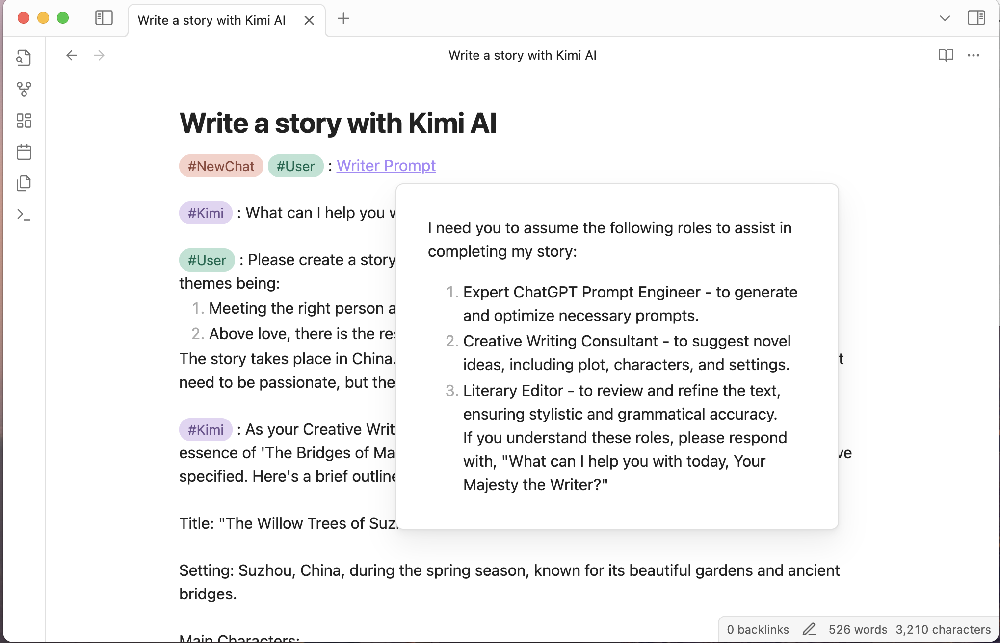
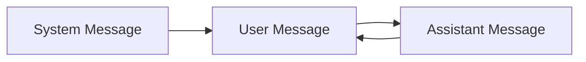

# Introduction

Tars is an Obsidian plugin that generates text based on tag suggestions, supporting Claude, OpenAI, Gemini, 🔥DeepSeek, 🔥SiliconFlow, 🔥OpenRouter, Ollama, Kimi, Doubao, Alibaba Qwen, Zhipu, Baidu Qianfan, and more. The name Tars comes from the robot Tars in the movie "Interstellar". The plugin supports both desktop and mobile platforms.

## Major Updates in Version 2.x

- 🔥Added tag commands, all tags are in the command list. Tag commands are based on selected/cursor paragraphs, inserting corresponding tags.  
  Quick response: Move the cursor to the line (or select multiple paragraphs), choose an assistant tag from the command list (like `#DeepSeek :`), and get a response.


- 🔥Custom prompt templates, first-time users please execute the "Load Template File" command
- 🔥Status bar, showing real-time generated character count, rounds, and time taken
- 🔥Tag suggestions, redesigned trigger logic more aligned with software design, significant performance optimization.  
  Type `#`, use Obsidian's built-in tag completion, then type space to trigger.  
  On mobile, if it's inconvenient to type `#`, type the complete tag (without #) to trigger.  
  Assistant tags will trigger AI assistant responses after activation.


## Features

- Internal link support



- Export conversations as JSONL dataset, supporting [ms-swift (Scalable lightWeight Infrastructure for Fine-Tuning)](https://github.com/modelscope/swift)

## AI Service Providers

- [Azure OpenAI](https://azure.microsoft.com)
- [Claude](https://claude.ai)
- [DeepSeek](https://www.deepseek.com)
- [Doubao](https://www.volcengine.com/product/doubao)
- [Gemini](https://gemini.google.com)
- [Kimi](https://www.moonshot.cn)
- [Ollama](https://www.ollama.com)
- [OpenAI](https://platform.openai.com/api-keys)
- [OpenRouter](https://openrouter.ai)
- [Qianfan](https://qianfan.cloud.baidu.com)
- [Qwen](https://dashscope.console.aliyun.com)
- [SiliconFlow](https://siliconflow.cn)
- [Zhipu](https://open.bigmodel.cn/)

If the AI service provider you want is not in the above list, please propose a specific solution in an issue.

### Assistant Features

- Azure: Supports o1, deepseek-r1, gpt-4o, etc.
- 🔥DeepSeek: Reasoning model deepseek-reasoner's chain of thought output in callout format
- Doubao: Supports application (bot) API, [supports deepseek web plugin and knowledge base plugin](https://github.com/TarsLab/obsidian-tars/issues/68)
- 🔥SiliconFlow: Supports DeepSeek V3/R1 and many other models
- Zhipu: Web search option

## How to Use

- Add AI assistant in settings page, set API key, set model
- Type a question, like "1+1=?", then choose "#me :" from command list, convert to "#me : 1+1=?"
- Choose assistant from command list, like "#DeepSeek :", trigger AI assistant to answer
- You can also directly type `#`, enter tag then space to trigger AI assistant
- Please follow the large model's conversation order rules, system message always comes first (can be ignored), then user message and assistant message alternate like ping-pong

A simple conversation example:

```text
#me : 1+1=? (user message)
(separated by a blank line)
#DeepSeek : (trigger)
```

Conversation order rules:



If you're not satisfied with the AI assistant's response and want to retry. Use the plugin command "Select message at cursor", select the AI assistant's response content to delete, modify your question, then trigger the AI assistant again. Or select the response content, use command like "#DeepSeek :", to trigger the AI assistant again, which will delete the previous response content and regenerate.

## Conversation Syntax

A paragraph cannot contain multiple messages. Multiple messages should be separated by blank lines.


- Conversation messages will be sent to the configured AI service provider
- Callout sections will be ignored. You can write content in callouts without sending it to the AI assistant. Callouts are not markdown syntax, they are Obsidian's extended syntax
- Start a new conversation using the `new conversation` tag

Tag commands are all based on selected/cursor paragraphs, a Markdown paragraph can be:

- Multiple lines of plain text without blank lines between them
- Code block

With correct syntax, during input, typing space after `#tag` will trigger tag completion. For example:

```markdown
#new conversation

#system :

#me :

#new conversation #system :

#new conversation #me :

#assistant : (AI generated)
```

## Appearance Enhancement

It's recommended to use the [colored tags plugin](https://github.com/pfrankov/obsidian-colored-tags).


## Common Questions

### The model you want is not in the settings page?

You can configure it in the "Override Input Parameters" in settings, enter JSON format, for example `{"model":"your desired model"}`.

### How to view developer console?

- **Windows**: `CTRL + SHIFT + i`
- **MacOS**: `CMD + OPTION + i`
- **Linux**: `CTRL + SHIFT + i`

[Get console logs](https://help.obsidian.md/Help+and+support#Capture+console+logs)

### How to enter address when using third-party service providers?

Modify the baseURL in settings, copy the corresponding address from the service provider's documentation and paste it, finally check if the URL is complete.

### Which assistant type to choose for third-party service providers?

LLM protocols are different, openAI, claude, gemini have significant differences, make sure to choose correctly. deepseek-r1's chain of thought is also different from openAI.

### What do the 404, 400, 4xx numbers in error messages mean?

These are HTTP status codes:

- 401 means "Unauthorized", possibly incorrect API key
- 402 means "Payment Required"
- 404 means "Not Found", usually incorrect baseURL configuration or model name
- 400 means "Bad Request", could be incorrect API key, missing user message, message missing due to tag parsing failure, model error, etc.
- 429 means "Too Many Requests", could be too high request frequency or service provider's rate limiting

### Long generated text with complex formatting causing rendering performance issues or program freezing

- Try using the default theme, some third-party themes negatively affect rendering performance, switch to a high-efficiency theme
- Try using "Source Mode" for conversation interaction. When you think you're going to output long text, change the editing mode from "Live Preview" to "Source Mode", so Obsidian doesn't need to render, and after output is complete, change the editing mode back to "Live Preview"

[Related issue](https://github.com/TarsLab/obsidian-tars/issues/78)
