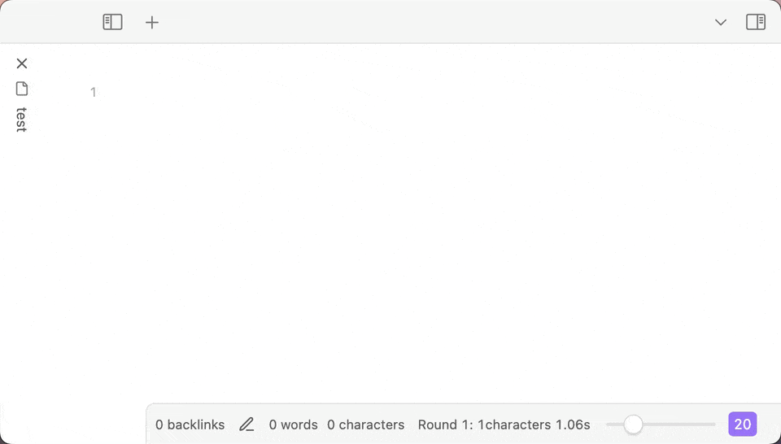

<h2 align="center">
    <p>
        <b>English</b> |
        <a href="https://github.com/TarsLab/obsidian-tars/blob/main/README_zh.md">中文</a>
    </p>
</h2>

# Introduction

Tars is an Obsidian plugin that supports text generation based on tag suggestions, using services like Claude, OpenAI, Gemini, 🔥DeepSeek, 🔥SiliconFlow, 🔥OpenRouter, Ollama, Kimi, Doubao, Qwen, Zhipu, QianFan & more. The name Tars comes from the robot Tars in the movie "Interstellar". The plugin supports both desktop and mobile devices.

## 🌟 3.1 Multimodal

### 🎨 Image Generation

- **GPT-Image-1**: Supports image generation and editing functions

### 👁️ Visual Understanding

- **Image Analysis**: Claude, OpenRouter, SiliconFlow, etc. can interpret images
- **Document Interpretation**: Claude and OpenRouter, etc. support PDF file analysis

> ⚠️ **Note**: Only embedded files (e.g. `![[example.jpg]]`) are supported. External URL links will not work.


## Major Updates in Version 2.x

- 🔥 Added tag commands, all tags are available in the command list. Tag commands insert the appropriate tags based on selected sections or the section at cursor position.  
  Quick response: Move the cursor to the line (or select multiple paragraphs), choose an assistant tag (like `#DeepSeek :`) from the command list to generate a response.


- 🔥 Custom prompt templates, run the "Load template file" command when using for the first time.
- 🔥 Status bar that displays real-time information about character count, rounds, and time spent.
- 🔥 Tag suggestions with redesigned trigger logic that better aligns with software design principles and significantly improved performance.  
  Type `#`, use Obsidian's native tag completion, then input space to trigger.  
  On mobile devices where typing `#` might be inconvenient, you can type the complete tag (without #) to trigger.  
  Assistant tags will generate AI responses when triggered.



## Features

- Support for internal links


- Export conversations to JSONL dataset, supports [ms-swift (Scalable lightWeight Infrastructure for Fine-Tuning)](https://github.com/modelscope/swift)

## AI providers

- [Azure OpenAI](https://azure.microsoft.com)
- [Claude](https://claude.ai)
- [DeepSeek](https://www.deepseek.com)
- [Doubao](https://www.volcengine.com/product/doubao)
- [Gemini](https://gemini.google.com)
- [Kimi](https://www.moonshot.cn)
- [Ollama](https://www.ollama.com)
- [OpenAI](https://platform.openai.com/api-keys)
- [OpenRouter](https://openrouter.ai)
- [Qianfan](https://qianfan.cloud.baidu.com)
- [Qwen](https://dashscope.console.aliyun.com)
- [SiliconFlow](https://siliconflow.cn)
- [X.ai Grok](https://x.ai)
- [Zhipu](https://open.bigmodel.cn/)

If the AI provider you want is not in the list above, you can propose a specific plan in the issue.

### Assistant features

- Azure: Supports o1, deepseek-r1, gpt-4o, etc.
- 🔥DeepSeek: The reasoning model deepseek-reasoner's CoT is output in callout format
- Doubao: Supports bot API, [Supports DeepSeek web search plugin and knowledge base plugin](https://github.com/TarsLab/obsidian-tars/issues/68)
- 🔥SiliconFlow: Supports many models such as DeepSeek V3/R1
- Zhipu: Web search option

## How to use

- Add an AI assistant in the settings page, set the API key, and configure the model.
- Enter a question, like "1+1=?", then select "#User :" from the command list to transform it into - "#User : 1+1=?"
- Select an assistant from the command list, like "#Claude :", to trigger the AI assistant to answer the question.
- You can also directly type `#`, enter the tag, and then type a space to trigger the AI assistant.
- Follow the conversation order rules of large language models: system messages always appear first (can be omitted), then user and assistant messages alternate like a ping-pong match.

A simple conversation example:

```text
#User : 1+1=?（user message）
(blank line)
#Claude :（trigger）
```

Conversation order rules:


If you are not satisfied with the AI assistant's answer and want to retry. Use the plugin command "Select the message at the cursor", select and delete the AI assistant's response content, modify your question, and trigger the AI assistant again. Or select the response content and use a command like "#Claude :" to retrigger the AI assistant, which will delete the previous response and generate a new one.

## Conversations syntax

A paragraph cannot contain multiple messages. Messages should be separated by blank lines.


- The conversation messages will send to the configured AI assistant.
- Callout sections will be ignored. You can write content in the callout without sending it to the AI assistant. Callout is not markdown syntax, it is an obsidian extension syntax.
- Start a new conversation with `NewChat` tag.

Tag commands are based on the paragraph at the cursor or in the selection. A Markdown paragraph can be:

- Multiple lines of plain text not separated by empty lines
- A code block

With correct syntax, when you input a space after #tag, it will trigger tag completion. For example:

```markdown
#NewChat

#System :

#User :

#NewChat #System :

#NewChat #User :

#Claude : (AI generate)
```

## Appearance customization

We recommend using the [colored tags plugin](https://github.com/pfrankov/obsidian-colored-tags).


## FAQ

### How to trigger?

There are several ways:

- Select tags from the command palette
- Type `#` + tag + space
- Directly type the complete tag (without #)

### Can't find the model you want in the settings?

You can configure it in the "Override input parameters" section in the settings by entering JSON format, such as `{"model":"your-desired-model"}`.

### How to view the developer console?

- **Windows**: `CTRL + SHIFT + i`
- **MacOS**: `CMD + OPTION + i`
- **Linux**: `CTRL + SHIFT + i`

[Capture console logs](https://help.obsidian.md/Help+and+support#Capture+console+logs)

### How to enter the baseUrl when using third-party services?

Modify the baseURL in the settings, copy and paste the corresponding address from the service provider's documentation, and finally check if the URL is complete.

### Which assistant type to choose for third-party service providers?

LLM protocols differ significantly between openAI, claude, and gemini. Make sure to select the correct one. The chain of thought in deepseek-r1 is also different from openAI.

### What do the 404, 400, 4xx numbers in error messages mean?

These are HTTP status codes:

- 401 means "Unauthorized", possibly due to an incorrect API key.
- 402 means "Payment Required".
- 404 means "Not Found", usually due to incorrect baseURL configuration or model name.
- 400 means "Bad Request", possibly due to incorrect API key, missing user messages, tag parsing failure - leading to missing messages, model errors, etc.
- 429 means "Too Many Requests", possibly due to high request frequency or service provider rate limits.

### Text generation is very long and complex, causing rendering performance issues or app freezing

- Try using the default theme. Some third-party themes can negatively impact rendering performance; switch to a more efficient theme.
- Try using "Source mode" for conversation interaction. When you expect long text output, change the editing mode from "Live preview" to "Source mode" so Obsidian doesn't need to render the content. After the output is complete, switch back to "Live preview" mode.

[Related issue](https://github.com/TarsLab/obsidian-tars/issues/78)
