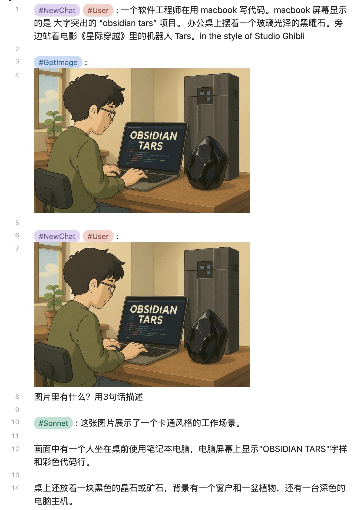
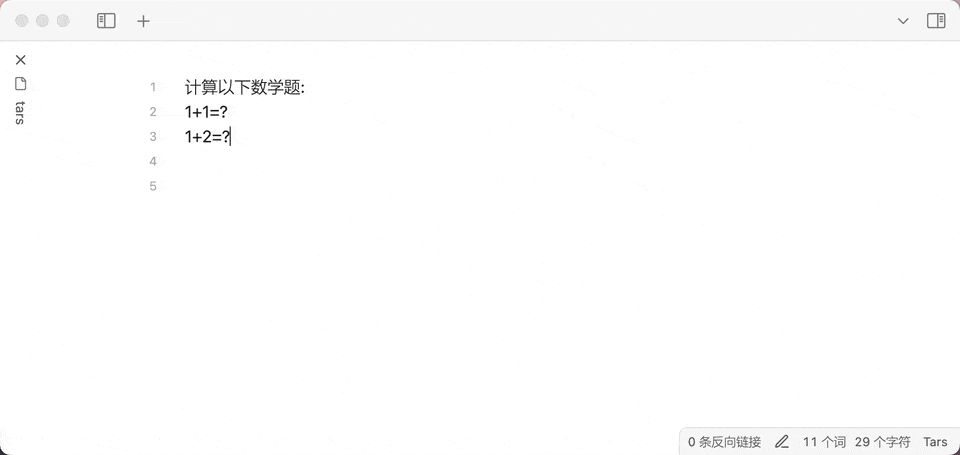
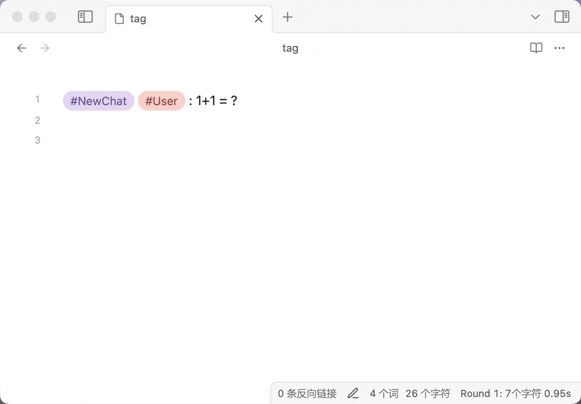
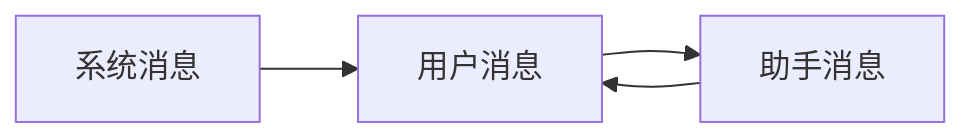
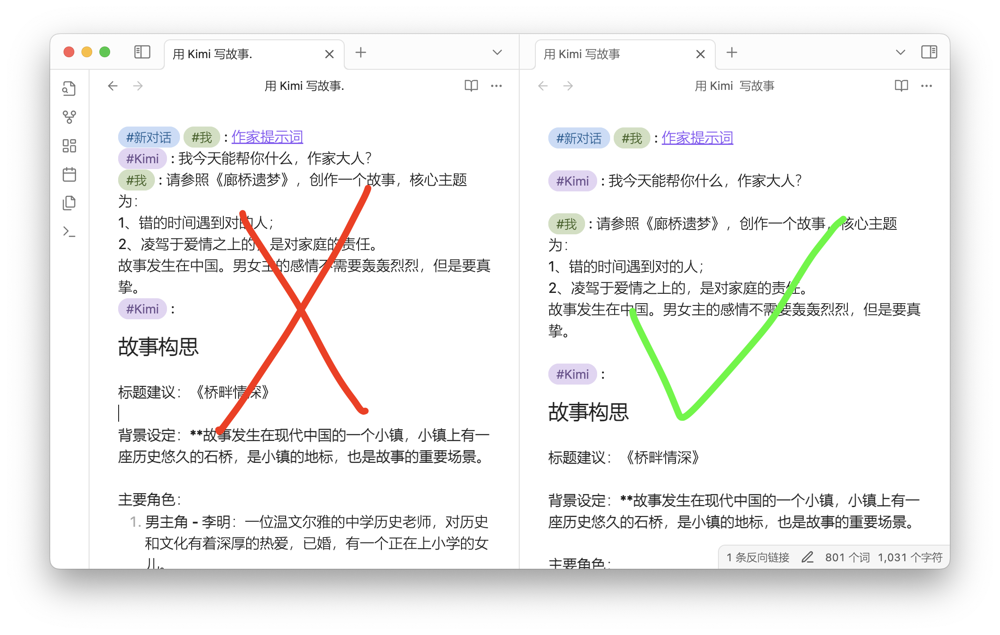
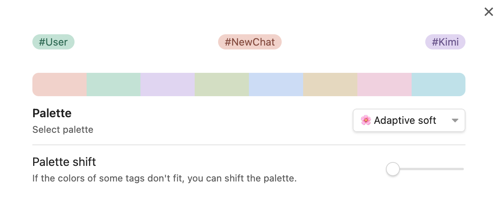

<h2 align="center">
	<p>
		<a href="https://github.com/TarsLab/obsidian-tars/blob/main/README.md">English</a> |
			<b>中文</b>
	<p>
</h2>

# 简介

Tars 是一个 Obsidian 插件，基于标签建议进行文本生成，支持 Claude、OpenAI、Gemini、🔥DeepSeek、🔥SiliconFlow、🔥OpenRouter、Ollama、Kimi、豆包、阿里千问、智谱、百度千帆等。Tars 这个名字来源于电影《星际穿越》中的机器人 Tars（塔斯）。插件支持桌面端和移动端。

## 🌟 3.1 多模态

### 🎨 图像生成

- **GPT-Image-1**: 支持图像生成和编辑功能

### 👁️ 视觉理解

- **图像分析**: Claude、OpenRouter、SiliconFlow 等看懂图片
- **文档解读**: Claude 和 OpenRouter 等支持 PDF 文件分析

> ⚠️ **注意**: 仅支持嵌入文件（例如 `![[example.jpg]]`）。不支持外部URL链接。



## 2.x 版本重大更新

- 🔥加入标签命令，所有标签都在命令列表里。标签命令基于选中/光标处的段落，插入相应的标签。  
  快速回答：把光标移到该行（或者选择多个段落），从命令列表中选择助手标签（比如`#DeepSeek :`），进行回答。



- 🔥自定义提示词模板, 首次使用请执行”加载模板文件”命令
- 🔥状态栏，实时显示生成的字符数量, 轮次，耗时。
- 🔥标签建议，重新设计的触发逻辑更符合软件设计，性能优化显著。  
  输入`#`，借用obsidian自身的标签补全后，再输入空格触发。  
  移动端如果不方便输入`#`，输入完整的标签（不带#），来触发。  
  助手标签在触发后，会进行AI助手回答。



## 特性

- 支持内部链接


- 将对话导出为 JSONL 数据集，支持 [ms-swift（Scalable lightWeight Infrastructure for Fine-Tuning）](https://github.com/modelscope/swift)

## AI 服务提供商

- [Azure OpenAI](https://azure.microsoft.com)
- [Claude](https://claude.ai)
- [DeepSeek 深度求索](https://www.deepseek.com)
- [Doubao 豆包](https://www.volcengine.com/product/doubao)
- [Gemini](https://gemini.google.com)
- [Kimi](https://www.moonshot.cn)
- [Ollama](https://www.ollama.com)
- [OpenAI](https://platform.openai.com/api-keys)
- [OpenRouter](https://openrouter.ai)
- [Qianfan 百度千帆](https://qianfan.cloud.baidu.com)
- [Qwen 阿里千问](https://dashscope.console.aliyun.com)
- [SiliconFlow 硅基流动](https://siliconflow.cn)
- [X.ai Grok](https://x.ai)
- [Zhipu 智谱](https://open.bigmodel.cn/)

如果上面列表没有你想要的 AI 服务提供商，可以在 issue 中提出具体方案。

### 助手特色

- Azure: 支持 o1，deepseek-r1，gpt-4o 等等
- 🔥DeepSeek：推理模型 deepseek-reasoner 的思维链以 callout 格式输出
- Doubao: 支持应用（bot）API，[支持 deepseek 联网插件和知识库插件](https://github.com/TarsLab/obsidian-tars/issues/68)
- 🔥SiliconFlow：支持 DeepSeek V3/R1 等等众多模型
- Zhipu：网络搜索选项

## 如何使用

- 在设置页面添加 AI 助手，设置 API 密钥，设置模型。
- 输入问题，比如“1+1=？”，然后在命令列表选择“#我 :”， 转为“#我 : 1+1=?”
- 在命令列表选择助手，比如“#DeepSeek :”，触发 AI 助手回答问题。
- 还可以直接输入`#`，输入标签后再输入空格，来触发 AI 助手。
- 请遵循大模型的对话顺序规则，系统消息总是最先出现（也可以忽略），然后用户消息和助手消息像打乒乓球一样轮流发言。

一个简单的对话例子如下：

```text
#我 : 1+1=?（用户消息）
(隔开一个空行)
#DeepSeek : （触发）
```

对话顺序规则如下：



如果觉得 AI 助手回答不满意，想要重试。使用插件命令“选择光标处的消息”，选中 AI 助手的回答内容进行删除，修改下你的提问，再次触发 AI 助手。或者选中回答内容，使用命令比如“#DeepSeek :”，重新触发 AI 助手，会删除之前的回答内容，重新生成。

## 对话语法

一个段落不能包含多条消息。多条消息应该通过空行分隔开来。



- 对话消息将发送到配置的 AI 服务提供商。
- 标注部分 (callout) 将被忽略。你可以在标注里写内容，不将其发送到 AI 助手。callout 不是 markdown 语法，是 obsidian 的扩展语法。
- 开始新对话，使用 `新对话` 标签。

标签命令都是基于选中/光标处的段落，一个 Markdown 段落可以是：

- 没有空行隔开的多行普通文本
- 代码块

在正确的语法情况下，在输入过程中，`#标签`后输入空格，会触发标签补全。例如：

```markdown
#新对话

#系统 :

#我 :

#新对话 #系统 :

#新对话 #我 :

#助手 : (AI生成)
```

## 外观美化

建议使用 [colored tags 插件](https://github.com/pfrankov/obsidian-colored-tags).



## 常见问题

### 如何触发?

有以下几种方式:

- 从命令面板选择标签
- 输入 `#` + 标签 + 空格
- 直接输入完整标签（不带#）

### 设置页面没有想要的模型？

可以在设置中的“覆盖输入参数”进行配置，输入 JSON 格式，例如 `{"model":"你想要的model"}`。

### 如何查看开发者控制台？

- **Windows**：`CTRL + SHIFT + i`
- **MacOS**：`CMD + OPTION + i`
- **Linux**：`CTRL + SHIFT + i`

[获取控制台日志](https://publish.obsidian.md/help-zh/%E5%B8%AE%E5%8A%A9%E4%B8%8E%E6%94%AF%E6%8C%81#%E8%8E%B7%E5%8F%96%E6%8E%A7%E5%88%B6%E5%8F%B0%E6%97%A5%E5%BF%97)

### 在使用第三方服务商时如何输入地址？

修改设置中的 baseURL，从服务商的文档复制对应的地址粘贴过去，最后检查下网址是否完整。

### 第三方服务商选择哪个助手类型？

LLM的协议是有区别的，openAI，claude，gemini 差别很大，注意要选对。deepseek-r1 的思维链也和 openAI 不同。

### 错误提示中的 404，400，4xx数字是什么意思？

这些是 HTTP 状态码：

- 401表示“未授权”（Unauthorized），可能是 API 密钥错误。
- 402表示“需要付款”（Payment Required）。
- 404表示“未找到”（Not Found），通常是 baseURL 配置错误，或者模型名称错误。
- 400表示“错误请求”（Bad Request），可能是 API 密钥错误，缺失用户消息，标签解析失败导致消息缺失，模型错误等等。
- 429表示“太多请求”（Too Many Requests），可能是请求频率过高，或者是服务商限制了请求频率。

### 生成文本很长，格式复杂，导致渲染性能问题或者程序假死

- 尝试使用默认主题，有些第三方主题对渲染性能有负面影响，改用高效率的主题。
- 尝试使用“源码模式”进行对话交互。当你觉得要输出长文本的时候，把编辑模式从“实时阅览”改为“源码模式”，这样obsidian不用去渲染，等输出完成后，再把编辑模式改回“实时阅览”。

[相关的issue](https://github.com/TarsLab/obsidian-tars/issues/78)

## 赞赏

如果你觉得这个插件对你有帮助，可以请作者喝杯咖啡☕️，支持一下后续的开发和维护工作。


