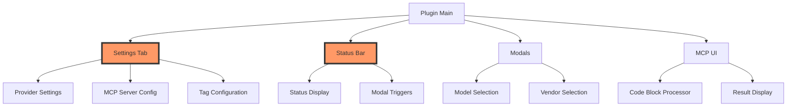
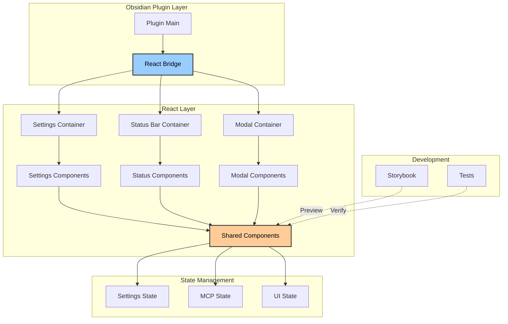
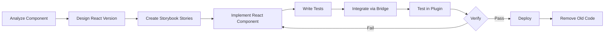
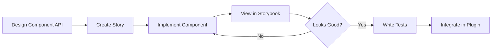
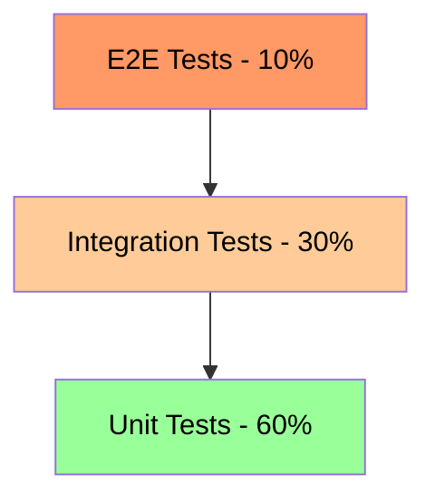
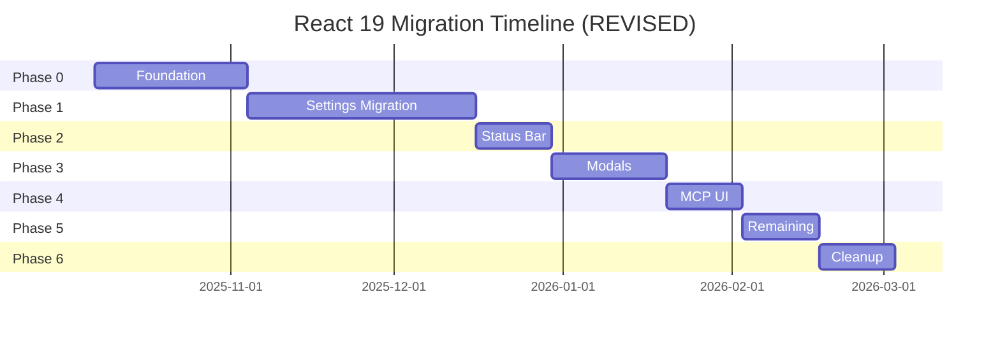

# React 19 Migration Plan for Obsidian TARS Plugin

**Version:** 1.1
**Date:** 2025-10-06
**Status:** Planning Phase - NOT STARTED
**Last Reviewed:** 2025-10-06

---

## Table of Contents

1. [Executive Summary](#executive-summary)
2. [Current State Analysis](#current-state-analysis)
3. [Migration Goals & Benefits](#migration-goals--benefits)
4. [React 19 Features & Advantages](#react-19-features--advantages)
5. [CSS Strategy & Styling](#css-strategy--styling)
6. [Technical Architecture](#technical-architecture)
7. [Migration Strategy](#migration-strategy)
8. [Phase-by-Phase Plan](#phase-by-phase-plan)
8. [Storybook Integration](#storybook-integration)
9. [Build System Migration](#build-system-migration)
10. [Testing Strategy](#testing-strategy)
11. [Risk Analysis & Mitigation](#risk-analysis--mitigation)
12. [Timeline & Resources](#timeline--resources)
13. [Success Metrics](#success-metrics)

---

## Executive Summary

This document outlines a comprehensive plan to migrate the Obsidian TARS plugin's UI from vanilla Obsidian API (DOM manipulation) to React 19, with Storybook integration for component development and testing. The migration will be **incremental** and **backward-compatible**, starting with the Settings UI and Status Bar components.

### Key Decisions
- **Approach**: Incremental migration (not big-bang)
- **Compatibility**: Maintain backward compatibility during transition
- **Build System**: Migrate from esbuild to Vite for better React/Storybook DX
- **React Version**: React 19 (latest features including React Compiler)
- **Component Library**: Custom components (no external UI library)
- **Priority Components**: Settings Tab → Status Bar → Modals → Other UI

---

## Current State Analysis

### UI Components Inventory

**✅ VERIFIED - 2025-10-06**

Based on deep code analysis, the plugin has the following UI components:

| Component | File | Lines | Complexity | Priority | Status |
|-----------|------|-------|------------|----------|--------|
| Settings Tab | [`settingTab.ts`](../src/settingTab.ts:1) | 843 | Very High | 1 | ✅ Verified |
| MCP Server Settings | [`settings/MCPServerSettings.ts`](../src/settings/MCPServerSettings.ts:1) | ~300 | High | 1b | ✅ Added |
| Status Bar Manager | [`statusBarManager.ts`](../src/statusBarManager.ts:1) | ~450 | High | 2 | ✅ Verified |
| Model Selection Modal | [`modal.ts`](../src/modal.ts:6) | 45 | Medium | 3 | ✅ Verified |
| Vendor Selection Modal | [`modal.ts`](../src/modal.ts:47) | 51 | Medium | 3 | ✅ Verified |
| Tool Browser Modal | [`modals/toolBrowserModal.ts`](../src/modals/toolBrowserModal.ts:1) | ~250 | High | 3b | ✅ Added |
| MCP Code Block Processor | [`mcp/codeBlockProcessor.ts`](../src/mcp/codeBlockProcessor.ts:1) | ~200 | Medium | 4 | ✅ Verified |
| Tag Suggest | [`suggest.ts`](../src/suggest.ts:1) | ~250 | Medium | 5 | ✅ Verified |
| MCP Tool Suggest | [`suggests/mcpToolSuggest.ts`](../src/suggests/mcpToolSuggest.ts:1) | ~200 | Medium | 5b | ✅ Added |
| MCP Parameter Suggest | [`suggests/mcpParameterSuggest.ts`](../src/suggests/mcpParameterSuggest.ts:1) | ~150 | Medium | 5c | ✅ Added |
| Prompt Modal | [`prompt/modal.ts`](../src/prompt/modal.ts:1) | ~30 | Low | 6 | ✅ Verified |
| Replace Tag Modal | [`commands/replaceTag.ts`](../src/commands/replaceTag.ts:1) | ~50 | Low | 7 | ✅ Verified |
| Regenerate Confirmation | [`commands/asstTag.ts`](../src/commands/asstTag.ts:1) | ~30 | Low | 8 | ✅ Verified |

**Total UI Surface Area:** ~2,850 lines of DOM manipulation code

### Current Tech Stack

**✅ VERIFIED - 2025-10-06**

```json
{
  "build": "esbuild",
  "bundler": "esbuild 0.25.10",
  "language": "TypeScript 5.9.3",
  "runtime": "Node 22.20.0",
  "platform": "Obsidian API 1.8.7",
  "ui": "Vanilla DOM manipulation",
  "testing": "vitest 3.2.4 + jsdom",
  "bundleSize": "7.7MB (unminified main.js)",
  "cssLines": 697
}
```

**Key Dependencies (from package.json):**
- Testing: `vitest`, `@vitest/ui`, `@vitest/coverage-v8`, `jsdom`
- No React dependencies currently installed
- No Vite build system (only esbuild)
- No Storybook installation

### Key Patterns Identified

**✅ VERIFIED - 2025-10-06**

1. **Direct DOM Manipulation**: Extensive use of `createEl()`, `createDiv()`, `Setting` class in 4+ main files
2. **Imperative UI Updates**: Manual state management and DOM updates throughout codebase
3. **Complex State Logic**: Settings tab has 843 lines with deeply nested state (reduced from initial estimate)
4. **Modular Separation Started**: MCP Server Settings extracted to separate file (`MCPServerSettings.ts`)
5. **Event Handlers**: Manual event listener management
6. **No Component Reusability**: Code duplication across similar UI patterns
7. **No React Infrastructure**: No React, no Vite, no Storybook currently present



---

## Migration Goals & Benefits

### Primary Goals

1. **Modernize UI Architecture**: Move to declarative, component-based UI
2. **Improve Developer Experience**: Enable faster UI development with Storybook
3. **Enhance Maintainability**: Reduce code complexity and improve testability
4. **Enable Component Reusability**: Share components across different UI areas
5. **Better Type Safety**: Leverage React 19's improved TypeScript support

### Expected Benefits

| Area | Current State | Post-Migration |
|------|---------------|----------------|
| **Code Volume** | ~2,850 lines (all UI code) | ~1,700-2,000 lines (estimated 30-40% reduction) |
| **Settings Tab** | 843 lines | ~500-600 lines (estimated) |
| **Testability** | Medium (vitest setup exists) | High (unit + integration + visual) |
| **Development Speed** | Slow (manual DOM manipulation) | Fast (component composition + Storybook) |
| **Bug Rate** | Higher (imperative, side effects) | Lower (declarative, predictable) |
| **Reusability** | Low (code duplication) | High (shared components) |
| **Type Safety** | Good (TypeScript strict enabled) | Excellent (React 19 + strict mode) |
| **Bundle Size** | 7.7MB unminified | Target: <8MB (React overhead managed) |

---

## ⚠️ Current State Assessment (Added 2025-10-06)

### Migration Readiness Status

**Overall Status:** ⚠️ **NOT STARTED - Phase 0 Required**

| Area | Status | Notes |
|------|--------|-------|
| **React Installation** | ❌ Not installed | No React dependencies in package.json |
| **Vite Build System** | ❌ Not configured | Only esbuild present |
| **Storybook** | ❌ Not installed | No .storybook directory |
| **Bridge Infrastructure** | ❌ Not present | No src/bridge directory |
| **Component Structure** | ❌ Not present | No src/components directory |
| **Testing Infrastructure** | ✅ Partial | Vitest configured, jsdom available |
| **TypeScript Config** | ✅ Good | Strict mode enabled, modern target |
| **Code Modularization** | ⚠️ In Progress | Some separation (e.g., MCPServerSettings) |

### Findings from Deep Code Review

**Positive Findings:**
1. ✅ **Testing Infrastructure Ready**: Vitest 3.2.4 already configured with jsdom
2. ✅ **TypeScript Strict Mode**: Good type safety foundation
3. ✅ **Modular Pattern Emerging**: `MCPServerSettings.ts` shows separation of concerns
4. ✅ **Modern Node/TS**: Node 22.20.0, TypeScript 5.9.3
5. ✅ **CSS Variables**: Extensive use of Obsidian CSS variables (697 lines)

**Challenges Identified:**
1. ❌ **No React Foundation**: Completely vanilla implementation, 100% DOM manipulation
2. ❌ **Large Bundle Size**: 7.7MB unminified (need to monitor React overhead)
3. ⚠️ **More Components Than Expected**: Found 13 UI components (vs original estimate of 9)
4. ⚠️ **New MCP UI Components**: Tool Browser Modal, MCP Suggests not in original plan
5. ❌ **No Build System for React**: Vite not configured, esbuild doesn't support React well

### Recommended Actions Before Starting

**CRITICAL - Must Complete Before Phase 0:**

1. **Decision Point**: Confirm commitment to React migration given:
   - Zero current React infrastructure
   - Significant upfront investment required
   - Larger UI surface area than originally planned (~2,850 lines)

2. **Budget Adjustment**: Phase 0 will require more time due to:
   - Complete greenfield React setup
   - Additional components discovered (Tool Browser, MCP Suggests)
   - Need to configure dual build system (esbuild + Vite)

3. **Updated Phase 0 Estimate**:
   - Original: 2 weeks
   - Recommended: **3-4 weeks** (due to zero foundation)

---

## React 19 Features & Advantages

### Why React 19?

React 19 brings several features that align perfectly with Obsidian plugin development:

#### 1. React Compiler (Previously React Forget)

```typescript
// Before: Manual memoization
const MemoizedComponent = React.memo(({ data }) => {
  const processed = useMemo(() => processData(data), [data]);
  return <div>{processed}</div>;
});

// After: Automatic optimization by compiler
function Component({ data }) {
  const processed = processData(data);
  return <div>{processed}</div>;
}
```

**Benefits for TARS**:
- Automatic performance optimization
- No need for manual `useMemo`, `useCallback`
- Smaller bundle size
- Better runtime performance

#### 2. Actions & Enhanced Form Handling

```typescript
// Perfect for Settings forms
function SettingInput({ setting, onUpdate }) {
  return (
    <form action={async (formData) => {
      await onUpdate(formData);
    }}>
      <input name="value" defaultValue={setting.value} />
      <button type="submit">Save</button>
    </form>
  );
}
```

**Benefits for TARS**:
- Simplified form handling (Settings tab has many inputs)
- Better loading states
- Progressive enhancement

#### 3. use() Hook for Data Loading

```typescript
function ProviderModels({ apiKey }) {
  // Suspend while loading
  const models = use(fetchModels(apiKey));
  
  return <ModelList models={models} />;
}
```

**Benefits for TARS**:
- Cleaner async logic (model fetching, MCP status)
- Better Suspense integration
- Simplified data dependencies

#### 4. Document Metadata & Asset Loading

```typescript
// Better resource management
function StoryBookPreview() {
  return (
    <>
      <link rel="stylesheet" href="obsidian-theme.css" precedence="high" />
      <Component />
    </>
  );
}
```

**Benefits for TARS**:
- Better Obsidian theme integration
- Cleaner resource management

#### 5. ref as Prop (No More forwardRef)

```typescript
// Before
const Input = forwardRef((props, ref) => <input ref={ref} {...props} />);

// After
function Input({ ref, ...props }) {
  return <input ref={ref} {...props} />;
}
```

**Benefits for TARS**:
- Simpler component APIs
- Better TypeScript inference
- Less boilerplate

---

## CSS Strategy & Styling

### Current State Analysis

**✅ VERIFIED - 2025-10-06**

The plugin currently uses a single [`styles.css`](../styles.css:1) file with:
- **Obsidian CSS Variables**: Extensive use of theme variables (`--background-*`, `--text-*`, `--size-*`, etc.)
- **BEM-like Naming**: Class names like `.mcp-server-section`, `.capability-tag`, `.mcp-tool-browser-modal`
- **No Scoping**: Global CSS namespace
- **697 lines**: Larger than originally estimated, well-organized
- **Component-Specific Sections**: Clear sections for Tool Browser Modal, capability tags, etc.

Example from current CSS:
```css
.capability-tag {
  display: inline-flex;
  align-items: center;
  padding: var(--size-2-1) var(--size-2-3);
  font-size: var(--font-ui-smaller);
  background-color: var(--background-modifier-border);
  color: var(--text-muted);
  border-radius: var(--radius-m);
}
```

### Obsidian CSS Variables

Obsidian provides a comprehensive design system through CSS variables. Key categories:

| Category | Examples | Usage |
|----------|----------|-------|
| **Colors** | `--background-primary`, `--text-normal`, `--text-error` | Backgrounds, text, states |
| **Spacing** | `--size-2-1` to `--size-4-4`, `--p-spacing` | Padding, margins, gaps |
| **Typography** | `--font-ui-small`, `--h4-size`, `--font-monospace` | Font sizes, weights |
| **Borders** | `--radius-s`, `--radius-m`, `--border-width` | Border radius, widths |
| **Interactive** | `--interactive-normal`, `--interactive-hover`, `--interactive-accent` | Button states |

**Critical**: These variables change based on:
- User's theme (light/dark/custom)
- Accent color preferences
- CSS snippet customizations

### Styling Approach Decision

#### Evaluated Options

| Approach | Pros | Cons | Verdict |
|----------|------|------|---------|
| **CSS Modules** | ✅ Scoped by default<br>✅ TypeScript support<br>✅ No runtime cost<br>✅ Familiar CSS<br>✅ Easy migration | ❌ Separate files | ✅ **RECOMMENDED** |
| **Vanilla Extract** | ✅ Type-safe<br>✅ Zero runtime<br>✅ Good DX | ❌ Learning curve<br>❌ Build complexity<br>❌ Overkill for this project | ❌ Too complex |
| **Tailwind CSS** | ✅ Fast development | ❌ Conflicts with Obsidian variables<br>❌ Large bundle size<br>❌ Different design language | ❌ Not compatible |
| **Styled Components** | ✅ Component co-location | ❌ Runtime cost<br>❌ Bundle size<br>❌ SSR complexity | ❌ Performance impact |
| **Plain CSS** | ✅ Simple | ❌ No scoping<br>❌ Name collisions<br>❌ Hard to maintain | ❌ Current pain points |

#### Recommendation: CSS Modules

**Why CSS Modules?**

1. **Automatic Scoping**: No more global namespace pollution
2. **TypeScript Integration**: Type-safe class names
3. **Zero Runtime Cost**: All work done at build time
4. **Familiar Syntax**: Just CSS with imports
5. **Easy Migration**: Can copy existing CSS almost as-is
6. **Obsidian Compatible**: Works perfectly with CSS variables
7. **Vite Support**: Built-in, no extra config needed

### CSS Modules Implementation

#### Basic Setup

```typescript
// vite.config.ts - CSS Modules configuration
export default defineConfig({
  css: {
    modules: {
      localsConvention: 'camelCaseOnly', // .my-class → styles.myClass
      generateScopedName: '[name]__[local]___[hash:base64:5]',
    },
  },
});
```

#### Component Example

```typescript
// src/components/shared/Button.module.css
.button {
  padding: var(--size-2-2) var(--size-4-2);
  border-radius: var(--radius-m);
  border: 1px solid var(--background-modifier-border);
  background-color: var(--interactive-normal);
  color: var(--text-normal);
  cursor: pointer;
  font-size: var(--font-ui-medium);
  font-weight: var(--font-semibold);
  transition: background-color 0.2s ease;
}

.button:hover {
  background-color: var(--interactive-hover);
}

.button:active {
  background-color: var(--interactive-active);
}

.button.danger {
  background-color: var(--text-error);
  color: var(--text-on-accent);
  border-color: var(--text-error);
}

.button.danger:hover {
  opacity: 0.9;
}

.button:disabled {
  opacity: 0.5;
  cursor: not-allowed;
}
```

```tsx
// src/components/shared/Button.tsx
import { type ButtonHTMLAttributes, forwardRef } from 'react';
import styles from './Button.module.css';
import { cn } from '@/utils/classNames';

interface ButtonProps extends ButtonHTMLAttributes<HTMLButtonElement> {
  variant?: 'default' | 'danger';
}

export const Button = forwardRef<HTMLButtonElement, ButtonProps>(
  ({ variant = 'default', className, ...props }, ref) => {
    return (
      <button
        ref={ref}
        className={cn(
          styles.button,
          variant === 'danger' && styles.danger,
          className
        )}
        {...props}
      />
    );
  }
);

Button.displayName = 'Button';
```

```typescript
// src/utils/classNames.ts - Utility for conditional classes
export function cn(...classes: (string | undefined | null | false)[]): string {
  return classes.filter(Boolean).join(' ');
}
```

#### TypeScript Support

```typescript
// CSS Modules type declarations (auto-generated by Vite)
declare module '*.module.css' {
  const classes: { [key: string]: string };
  export default classes;
}
```

### Migrating Existing Styles

#### Before (Global CSS)

```css
/* styles.css */
.capability-tag {
  display: inline-flex;
  align-items: center;
  padding: var(--size-2-1) var(--size-2-3);
  font-size: var(--font-ui-smaller);
  background-color: var(--background-modifier-border);
  color: var(--text-muted);
  border-radius: var(--radius-m);
}
```

```typescript
// Component using global class
el.createEl('span', {
  text: 'Vision',
  cls: 'capability-tag'
});
```

#### After (CSS Modules)

```css
/* src/components/shared/Tag.module.css */
.tag {
  display: inline-flex;
  align-items: center;
  padding: var(--size-2-1) var(--size-2-3);
  font-size: var(--font-ui-smaller);
  background-color: var(--background-modifier-border);
  color: var(--text-muted);
  border-radius: var(--radius-m);
  border: var(--border-width) solid var(--background-modifier-border-hover);
  white-space: nowrap;
}
```

```tsx
// src/components/shared/Tag.tsx
import styles from './Tag.module.css';

interface TagProps {
  children: React.ReactNode;
  icon?: string;
}

export function Tag({ children, icon }: TagProps) {
  return (
    <span className={styles.tag}>
      {icon && <span>{icon} </span>}
      {children}
    </span>
  );
}
```

### Obsidian Variables in Storybook

#### Problem

Storybook runs outside Obsidian, so CSS variables aren't available by default.

#### Solution: Variable Extraction & Injection

**Step 1: Extract Obsidian Variables**

```typescript
// scripts/extract-obsidian-variables.ts
import { readFileSync, writeFileSync } from 'fs';
import { App } from 'obsidian';

/**
 * This script extracts CSS variables from a running Obsidian instance
 * Run this in Obsidian's developer console:
 *
 * Copy and paste this into console:
 */
const extractScript = `
(() => {
  const styles = getComputedStyle(document.documentElement);
  const variables = {};
  
  // Common Obsidian variable prefixes
  const prefixes = [
    '--background',
    '--text',
    '--interactive',
    '--size',
    '--font',
    '--h1', '--h2', '--h3', '--h4', '--h5', '--h6',
    '--radius',
    '--border',
    '--p-spacing',
  ];
  
  // Extract all matching variables
  for (let i = 0; i < styles.length; i++) {
    const prop = styles[i];
    if (prefixes.some(prefix => prop.startsWith(prefix))) {
      variables[prop] = styles.getPropertyValue(prop).trim();
    }
  }
  
  // Download as JSON
  const json = JSON.stringify(variables, null, 2);
  const blob = new Blob([json], { type: 'application/json' });
  const url = URL.createObjectURL(blob);
  const a = document.createElement('a');
  a.href = url;
  a.download = 'obsidian-variables.json';
  a.click();
})();
`;

console.log('Copy this script into Obsidian developer console:');
console.log(extractScript);
```

**Step 2: Generate CSS from Variables**

```typescript
// scripts/generate-storybook-css.ts
import { readFileSync, writeFileSync } from 'fs';

const variables = JSON.parse(
  readFileSync('.storybook/obsidian-variables.json', 'utf-8')
);

const css = `:root {
${Object.entries(variables)
  .map(([key, value]) => `  ${key}: ${value};`)
  .join('\n')}
}

body {
  background-color: var(--background-primary);
  color: var(--text-normal);
  font-family: var(--font-text);
  font-size: var(--font-ui-medium);
}
`;

writeFileSync('.storybook/obsidian-theme.css', css);
console.log('✅ Generated .storybook/obsidian-theme.css');
```

**Step 3: Include in Storybook**

```typescript
// .storybook/preview.ts
import type { Preview } from '@storybook/react';
import './obsidian-theme.css'; // ← Load extracted variables

const preview: Preview = {
  parameters: {
    backgrounds: {
      default: 'obsidian',
      values: [
        {
          name: 'obsidian',
          value: 'var(--background-primary)',
        },
        {
          name: 'obsidian-secondary',
          value: 'var(--background-secondary)',
        },
      ],
    },
    layout: 'padded',
  },
};

export default preview;
```

**Step 4: Provide Both Light & Dark Themes**

```typescript
// .storybook/preview.ts
import './obsidian-theme-light.css';
import './obsidian-theme-dark.css';

export const decorators = [
  (Story, context) => {
    const theme = context.globals.theme || 'dark';
    
    useEffect(() => {
      document.documentElement.setAttribute('data-theme', theme);
    }, [theme]);
    
    return <Story />;
  },
];

export const globalTypes = {
  theme: {
    name: 'Theme',
    description: 'Obsidian theme',
    defaultValue: 'dark',
    toolbar: {
      icon: 'circlehollow',
      items: [
        { value: 'light', title: 'Light' },
        { value: 'dark', title: 'Dark' },
      ],
      showName: true,
    },
  },
};
```

```css
/* .storybook/obsidian-theme-dark.css */
[data-theme="dark"] {
  --background-primary: #1e1e1e;
  --background-secondary: #252525;
  --text-normal: #dcddde;
  --text-muted: #999999;
  /* ... other dark theme variables */
}

/* .storybook/obsidian-theme-light.css */
[data-theme="light"] {
  --background-primary: #ffffff;
  --background-secondary: #f5f5f5;
  --text-normal: #2e3338;
  --text-muted: #7a7a7a;
  /* ... other light theme variables */
}
```

### Alternative: Runtime Variable Fallbacks

For components that might render outside Obsidian:

```css
/* Component.module.css */
.container {
  /* Fallback if Obsidian variables don't exist */
  background-color: var(--background-primary, #1e1e1e);
  color: var(--text-normal, #dcddde);
  padding: var(--size-4-2, 12px);
  border-radius: var(--radius-m, 8px);
}
```

### File Organization

```
src/
├── components/
│   ├── settings/
│   │   ├── SettingsTab.tsx
│   │   ├── SettingsTab.module.css
│   │   ├── ProviderSettings.tsx
│   │   ├── ProviderSettings.module.css
│   │   └── ...
│   └── shared/
│       ├── Button.tsx
│       ├── Button.module.css
│       ├── Input.tsx
│       ├── Input.module.css
│       └── ...
├── styles/
│   ├── global.css              # Global resets, utility classes
│   └── variables.css           # Any custom variables (rare)
└── utils/
    └── classNames.ts           # cn() utility

.storybook/
├── obsidian-variables.json     # Extracted from Obsidian
├── obsidian-theme-light.css    # Generated light theme
├── obsidian-theme-dark.css     # Generated dark theme
└── preview.ts                  # Imports theme CSS
```

### Global Styles Strategy

Keep minimal global CSS for:

```css
/* src/styles/global.css */

/* CSS Reset - only if needed */
* {
  box-sizing: border-box;
}

/* Utility classes - use sparingly */
.sr-only {
  position: absolute;
  width: 1px;
  height: 1px;
  padding: 0;
  margin: -1px;
  overflow: hidden;
  clip: rect(0, 0, 0, 0);
  white-space: nowrap;
  border-width: 0;
}

/* Component base - if needed */
.tars-root {
  font-family: var(--font-text);
  color: var(--text-normal);
}
```

### Migration Checklist

For each component being migrated:

- [ ] Create `.module.css` file alongside component
- [ ] Copy relevant styles from [`styles.css`](../styles.css:1)
- [ ] Convert class names to camelCase (`.my-class` → `myClass`)
- [ ] Import styles in component: `import styles from './Component.module.css'`
- [ ] Use `styles.className` in JSX
- [ ] Test in Storybook with both themes
- [ ] Test in Obsidian plugin
- [ ] Remove old classes from global `styles.css`

### Best Practices

1. **One Module per Component**: Keep styles close to components
2. **Use Obsidian Variables**: Always prefer `var(--variable)` over hardcoded values
3. **Provide Fallbacks**: For dev/test environments: `var(--size-4-2, 12px)`
4. **Avoid Nesting**: CSS Modules doesn't need deep nesting
5. **Composition**: Use `composes` for shared styles within modules
6. **Naming**: Use descriptive class names, they'll be scoped anyway

```css
/* Good: Descriptive names, Obsidian variables */
.button {
  padding: var(--size-2-2) var(--size-4-2);
  background: var(--interactive-normal);
}

.button.primary {
  background: var(--interactive-accent);
}

/* Avoid: Generic names, magic numbers */
.btn {
  padding: 8px 16px;
  background: #4a5568;
}
```

### Performance Considerations

| Metric | CSS Modules | Impact |
|--------|-------------|--------|
| **Bundle Size** | +0.5-1KB per component | Minimal |
| **Runtime Cost** | Zero (build-time) | None |
| **Parse Time** | Same as regular CSS | None |
| **Specificity** | Low (single class) | Better performance |

### Tooling Setup

```json
// package.json additions
{
  "devDependencies": {
    "typescript-plugin-css-modules": "^5.0.0",
    "@types/css-modules": "^1.0.0"
  },
  "scripts": {
    "extract-vars": "node scripts/extract-obsidian-variables.ts",
    "generate-theme": "node scripts/generate-storybook-css.ts"
  }
}
```

```json
// tsconfig.json - Enable CSS Modules types
{
  "compilerOptions": {
    "plugins": [
      {
        "name": "typescript-plugin-css-modules"
      }
    ]
  }
}
```

### Summary

**Chosen Approach**: CSS Modules
**Rationale**:
- ✅ Simple, familiar, no learning curve
- ✅ Perfect compatibility with Obsidian variables
- ✅ Zero runtime cost
- ✅ TypeScript support
- ✅ Easy migration from current CSS

**Storybook Strategy**:
- Extract CSS variables from Obsidian via developer console
- Generate theme CSS files (light/dark)
- Load in Storybook preview
- Support theme switching in Storybook toolbar

---

## Technical Architecture

### Proposed Architecture



### File Structure

```
src/
├── components/                    # React components
│   ├── settings/                  # Settings-related components
│   │   ├── SettingsTab.tsx       # Main settings container
│   │   ├── ProviderSettings.tsx  # Provider configuration
│   │   ├── MCPServerConfig.tsx   # MCP server settings
│   │   ├── TagConfiguration.tsx  # Tag settings
│   │   └── index.ts
│   ├── status/                    # Status bar components
│   │   ├── StatusBar.tsx
│   │   ├── StatusModal.tsx
│   │   └── index.ts
│   ├── modals/                    # Modal components
│   │   ├── ModelSelector.tsx
│   │   ├── VendorSelector.tsx
│   │   └── index.ts
│   ├── shared/                    # Shared/common components
│   │   ├── Button.tsx
│   │   ├── Input.tsx
│   │   ├── Select.tsx
│   │   ├── Toggle.tsx
│   │   ├── TextArea.tsx
│   │   ├── CollapsibleSection.tsx
│   │   └── index.ts
│   └── mcp/                       # MCP-specific components
│       ├── CodeBlockProcessor.tsx
│       ├── ResultDisplay.tsx
│       └── index.ts
├── hooks/                         # Custom React hooks
│   ├── useSettings.ts
│   ├── useMCPStatus.ts
│   ├── useObsidianTheme.ts
│   └── index.ts
├── bridge/                        # Obsidian ↔ React bridge
│   ├── ReactBridge.ts            # Main bridge class
│   ├── createReactContainer.ts   # Container creation utilities
│   └── index.ts
├── types/                         # TypeScript types
│   ├── components.ts             # Component prop types
│   └── index.ts
└── [existing files...]

.storybook/                        # Storybook configuration
├── main.ts
├── preview.ts
└── obsidian-theme.css            # Obsidian theme for stories

stories/                           # Component stories
├── settings/
│   ├── ProviderSettings.stories.tsx
│   └── MCPServerConfig.stories.tsx
├── shared/
│   ├── Button.stories.tsx
│   └── Input.stories.tsx
└── [other stories...]
```

### Bridge Pattern

The bridge connects Obsidian's imperative API with React's declarative model:

```typescript
// src/bridge/ReactBridge.ts
import { createRoot, type Root } from 'react-dom/client';
import type { App } from 'obsidian';

export class ReactBridge {
  private roots: Map<HTMLElement, Root> = new Map();
  
  constructor(private app: App) {}
  
  mount(
    container: HTMLElement,
    component: React.ComponentType<any>,
    props: any
  ): void {
    const root = createRoot(container);
    root.render(React.createElement(component, {
      ...props,
      app: this.app
    }));
    this.roots.set(container, root);
  }
  
  unmount(container: HTMLElement): void {
    const root = this.roots.get(container);
    if (root) {
      root.unmount();
      this.roots.delete(container);
    }
  }
  
  unmountAll(): void {
    for (const [container, root] of this.roots) {
      root.unmount();
    }
    this.roots.clear();
  }
}
```

### Component Example: Settings Section

```typescript
// src/components/settings/ProviderSettings.tsx
import { useState } from 'react';
import type { ProviderSettings as ProviderSettingsType } from '../../settings';
import { Input } from '../shared/Input';
import { Button } from '../shared/Button';
import { Select } from '../shared/Select';

interface Props {
  settings: ProviderSettingsType;
  onUpdate: (settings: ProviderSettingsType) => Promise<void>;
  onRemove: () => Promise<void>;
}

export function ProviderSettings({ settings, onUpdate, onRemove }: Props) {
  const [tag, setTag] = useState(settings.tag);
  const [model, setModel] = useState(settings.options.model);
  
  const handleSave = async () => {
    await onUpdate({
      ...settings,
      tag,
      options: { ...settings.options, model }
    });
  };
  
  return (
    <details className="provider-settings">
      <summary>{settings.tag} ({settings.vendor})</summary>
      
      <div className="settings-content">
        <Input
          label="Assistant Tag"
          value={tag}
          onChange={setTag}
          placeholder={settings.vendor}
        />
        
        <Select
          label="Model"
          value={model}
          options={[/* model options */]}
          onChange={setModel}
        />
        
        <div className="button-group">
          <Button onClick={handleSave}>Save</Button>
          <Button variant="danger" onClick={onRemove}>
            Remove
          </Button>
        </div>
      </div>
    </details>
  );
}
```

---

## Migration Strategy

### Core Principles

1. **Incremental Migration**: Migrate one component at a time
2. **Backward Compatibility**: Maintain existing vanilla components until replaced
3. **Feature Parity**: Ensure React version has exact same functionality
4. **Test-Driven**: Write tests before and after migration
5. **User-Transparent**: No visible changes to end users (UI/UX identical)

### Migration Pattern

For each component, follow this pattern:



### Coexistence Strategy

During migration, both systems will coexist:

```typescript
// src/settingTab.ts (Transitional)
export class TarsSettingTab extends PluginSettingTab {
  private reactBridge: ReactBridge;
  
  display(): void {
    const { containerEl } = this;
    containerEl.empty();
    
    // Feature flag for gradual rollout
    if (this.plugin.settings.useReactUI) {
      // React version
      this.reactBridge.mount(
        containerEl,
        SettingsTab,
        { plugin: this.plugin }
      );
    } else {
      // Legacy version (existing code)
      this.displayLegacy();
    }
  }
  
  private displayLegacy(): void {
    // Existing implementation...
  }
}
```

---

## Phase-by-Phase Plan

### Phase 0: Foundation (Weeks 1-4) ⚠️ UPDATED

**Goal**: Set up infrastructure for React development

**⚠️ STATUS (2025-10-06):** NOT STARTED - No React infrastructure exists

**Updated Timeline:** 3-4 weeks (increased from 2 weeks due to zero foundation)

#### Tasks

1. **Setup Vite Build System** (Week 1)
   - Install Vite and necessary plugins
   - Configure TypeScript for React
   - **Configure dual build system** (keep esbuild for now, add Vite)
   - Update build scripts in package.json
   - Test build output compatibility with Obsidian
   - Validate bundle size doesn't balloon

2. **Install React 19 & Dependencies** (Week 1)
   ```bash
   npm install react@19 react-dom@19
   npm install -D @types/react@19 @types/react-dom@19
   npm install -D @vitejs/plugin-react
   npm install -D babel-plugin-react-compiler
   ```

3. **Create Bridge Infrastructure** (Week 2)
   - Create `src/bridge` directory
   - Implement `ReactBridge` class for mounting/unmounting
   - Create container utilities
   - Add feature flags for gradual rollout
   - Test bridge with simple "Hello World" component

4. **Setup Storybook** (Week 2-3)
   ```bash
   npx storybook@latest init
   ```
   - Configure for Vite
   - Extract Obsidian CSS variables (manual process via dev console)
   - Generate theme CSS files (light/dark)
   - Create preview environment
   - Test theme switching

5. **Create Shared Component Library** (Week 3-4)
   - Create `src/components/shared` directory
   - Basic UI primitives: Button, Input, Select, Toggle, TextArea
   - Based on existing Obsidian patterns (analyze current DOM code)
   - CSS Modules for each component
   - Storybook stories for each
   - Unit tests for each

6. **Configure CSS Modules** (Week 3)
   - Configure Vite for CSS Modules
   - Setup TypeScript CSS Module declarations
   - Create utility functions (cn helper)
   - Test scoping works correctly

**Deliverables**:
- ✅ Vite build working alongside esbuild (dual build)
- ✅ React 19 installed and configured
- ✅ Bridge system functional with test component
- ✅ Storybook running with Obsidian theme
- ✅ 5+ shared components with stories and CSS Modules
- ✅ Feature flags system in place
- ✅ Documentation for bridge usage

**Success Criteria**:
- Plugin builds successfully with both esbuild AND Vite
- CSS Modules working (scoped class names visible in build)
- Can mount a simple React component in Obsidian settings
- Storybook displays components with correct Obsidian styling
- Theme switching works in Storybook (light ↔ dark)
- All Obsidian CSS variables available in Storybook
- Bundle size increase < 500KB
- All existing functionality still works (no regressions)

---

### Phase 1: Settings Tab Migration (Weeks 5-10) ⚠️ UPDATED

**Goal**: Migrate the complex Settings Tab to React

**⚠️ STATUS (2025-10-06):** NOT STARTED

**Updated Timeline:** Weeks 5-10 (adjusted due to Phase 0 extension)
**Actual Complexity:** Higher than originally estimated due to:
- Settings Tab: 843 lines (not 1,432 as originally thought)
- MCP Server Settings: Additional ~300 lines in separate file
- New components discovered: Tool Browser Modal integration

#### Component Breakdown

The settings tab will be broken into these React components:

```
SettingsTab (Container)
├── AIAssistantsSection
│   ├── ProviderList
│   │   └── ProviderSettings (repeatable)
│   │       ├── TagSection
│   │       ├── ModelSelector
│   │       ├── APIKeyInput
│   │       ├── BaseURLSection
│   │       └── ParametersSection
│   └── AddProviderButton
├── MessageTagsSection
│   ├── TagInput (NewChat)
│   ├── TagInput (User)
│   └── TagInput (System)
├── SystemMessageSection
│   ├── EnableToggle
│   └── MessageTextArea
├── AdvancedSection
│   ├── ConfirmRegenerateToggle
│   ├── InternalLinksToggle
│   ├── AnswerDelaySlider
│   ├── ReplaceTagToggle
│   └── ExportToggle
└── MCPServersSection
    ├── GlobalSettings
    ├── ServerList
    │   └── MCPServerConfig (repeatable)
    │       ├── ServerControls
    │       ├── NameInput
    │       ├── ConfigurationInput
    │       └── DisplayModeToggle
    └── QuickAddButtons
```

#### Implementation Steps

1. **Week 3: Core Structure**
   - Create [`SettingsTab.tsx`](../src/components/settings/SettingsTab.tsx:1) container
   - Implement section components
   - Setup state management with hooks
   - Create Storybook stories

2. **Week 4: Provider Settings**
   - Migrate [`ProviderSettings`](../src/components/settings/ProviderSettings.tsx:1) component
   - Implement model fetching with `use()` hook
   - Create vendor selection logic
   - Add form validation

3. **Week 5: MCP Server Configuration**
   - Migrate MCP server UI (most complex part)
   - Implement config validation
   - Add test button functionality
   - Handle display mode switching

4. **Week 6: Integration & Testing**
   - Integrate via bridge
   - Add comprehensive tests
   - Performance testing
   - Bug fixes and polish

**Deliverables**:
- ✅ Complete Settings Tab in React
- ✅ Feature parity with vanilla version
- ✅ 20+ Storybook stories
- ✅ Unit tests for all components
- ✅ Integration tests via bridge

**Migration Approach**:

```typescript
// Feature flag for gradual rollout
export const SETTINGS_FEATURES = {
  useReactProviderSettings: true,  // Enable per section
  useReactMCPSettings: false,      // Gradual rollout
  useReactTagSettings: false,
} as const;
```

**Success Criteria**:
- All settings functionality works identically
- Performance equal or better than vanilla
- No regressions in user workflows
- Code reduction of 30%+

---

### Phase 2: Status Bar Migration (Weeks 7-8)

**Goal**: Migrate Status Bar and related modals to React

#### Component Breakdown

```
StatusBar (Container)
├── StatusDisplay
│   ├── GeneratingIndicator
│   ├── SuccessIndicator
│   ├── ErrorIndicator
│   └── MCPStatusIndicator
└── StatusModals
    ├── GenerationStatsModal
    ├── MCPStatusModal
    └── ErrorDetailModal
```

#### Implementation Steps

1. **Week 7: Status Bar Component**
   - Create [`StatusBar.tsx`](../src/components/status/StatusBar.tsx:1)
   - Implement status indicators
   - Add click handlers for modals
   - Create stories for all states

2. **Week 8: Modal Components**
   - Migrate status modals to React
   - Implement modal portal system
   - Add animations
   - Integration testing

**Deliverables**:
- ✅ Status Bar in React
- ✅ All status modals in React
- ✅ 10+ stories for different states
- ✅ Tests for status updates
- ✅ Modal tests

**Success Criteria**:
- Status updates work in real-time
- Modals display correctly
- Click interactions functional
- No performance degradation

---

### Phase 3: Modal Components (Weeks 9-10)

**Goal**: Migrate selection modals and confirmation dialogs

#### Components to Migrate

1. **Model Selection Modal** ([`modal.ts`](../src/modal.ts:6))
2. **Vendor Selection Modal** ([`modal.ts`](../src/modal.ts:47))
3. **Regenerate Confirmation** ([`commands/asstTag.ts`](../src/commands/asstTag.ts:177))
4. **Replace Tag Modal** ([`commands/replaceTag.ts`](../src/commands/replaceTag.ts:50))

#### Implementation Steps

1. **Week 9: Selection Modals**
   - Create modal component system
   - Implement fuzzy search
   - Add keyboard navigation
   - Create stories

2. **Week 10: Confirmation Dialogs**
   - Migrate confirmation dialogs
   - Add accessibility features
   - Integration testing

**Deliverables**:
- ✅ All modals in React
- ✅ Reusable modal system
- ✅ Accessible keyboard navigation
- ✅ 8+ modal stories

---

### Phase 4: MCP UI Components (Weeks 11-12)

**Goal**: Migrate MCP-specific UI components

#### Components

1. **Code Block Processor** ([`mcp/codeBlockProcessor.ts`](../src/mcp/codeBlockProcessor.ts:1))
2. **Result Display**
3. **Tool Execution UI**

#### Implementation Steps

1. **Week 11: Code Block Processor**
   - Create React component
   - Implement collapsible results
   - Add syntax highlighting
   - Error display

2. **Week 12: Result Display**
   - Tool execution UI
   - Progress indicators
   - Error handling

**Deliverables**:
- ✅ MCP UI in React
- ✅ Better error visualization
- ✅ Improved UX

---

### Phase 5: Remaining Components (Weeks 13-14)

**Goal**: Migrate remaining UI components

#### Components

1. **Tag Suggest** ([`suggest.ts`](../src/suggest.ts:1))
2. **Prompt Modal** ([`prompt/modal.ts`](../src/prompt/modal.ts:1))

#### Implementation Steps

- Migrate remaining components
- Ensure complete coverage
- Final integration testing

---

### Phase 6: Cleanup & Optimization (Weeks 15-16)

**Goal**: Remove legacy code, optimize, and finalize

#### Tasks

1. **Remove Legacy Code**
   - Delete vanilla UI implementations
   - Remove feature flags
   - Clean up dependencies

2. **Performance Optimization**
   - Bundle size optimization
   - React Compiler configuration
   - Lazy loading analysis

3. **Documentation**
   - Component documentation
   - Storybook documentation
   - Migration guide for contributors

4. **Final Testing**
   - Full regression testing
   - Performance benchmarks
   - User acceptance testing

**Deliverables**:
- ✅ Legacy code removed
- ✅ Optimized bundle
- ✅ Complete documentation
- ✅ All tests passing

---

## Storybook Integration

### Why Storybook?

Storybook provides:
1. **Isolated Development**: Build components without plugin context
2. **Visual Testing**: See all component states instantly
3. **Documentation**: Auto-generated component docs
4. **Testing**: Visual regression and interaction tests
5. **Collaboration**: Designers/reviewers can see components

### Setup Configuration

```typescript
// .storybook/main.ts
import type { StorybookConfig } from '@storybook/react-vite';

const config: StorybookConfig = {
  stories: ['../stories/**/*.stories.@(ts|tsx)'],
  addons: [
    '@storybook/addon-links',
    '@storybook/addon-essentials',
    '@storybook/addon-interactions',
    '@storybook/addon-a11y', // Accessibility testing
  ],
  framework: {
    name: '@storybook/react-vite',
    options: {},
  },
  docs: {
    autodocs: 'tag',
  },
};

export default config;
```

```typescript
// .storybook/preview.ts
import type { Preview } from '@storybook/react';
import './obsidian-theme.css'; // Obsidian CSS variables

const preview: Preview = {
  parameters: {
    actions: { argTypesRegex: '^on[A-Z].*' },
    controls: {
      matchers: {
        color: /(background|color)$/i,
        date: /Date$/,
      },
    },
    backgrounds: {
      default: 'obsidian',
      values: [
        {
          name: 'obsidian',
          value: 'var(--background-primary)',
        },
      ],
    },
  },
};

export default preview;
```

### Example Story

```typescript
// stories/settings/ProviderSettings.stories.tsx
import type { Meta, StoryObj } from '@storybook/react';
import { ProviderSettings } from '../../src/components/settings/ProviderSettings';

const meta = {
  title: 'Settings/ProviderSettings',
  component: ProviderSettings,
  parameters: {
    layout: 'padded',
  },
  tags: ['autodocs'],
} satisfies Meta<typeof ProviderSettings>;

export default meta;
type Story = StoryObj<typeof meta>;

export const OpenAI: Story = {
  args: {
    settings: {
      tag: 'openai',
      vendor: 'OpenAI',
      options: {
        model: 'gpt-4',
        apiKey: '***',
        baseURL: 'https://api.openai.com/v1',
        parameters: {},
      },
    },
    onUpdate: async (settings) => {
      console.log('Updated:', settings);
    },
    onRemove: async () => {
      console.log('Removed');
    },
  },
};

export const Claude: Story = {
  args: {
    settings: {
      tag: 'claude',
      vendor: 'Claude',
      options: {
        model: 'claude-3-5-sonnet-20241022',
        apiKey: '***',
        baseURL: 'https://api.anthropic.com',
        parameters: {},
        enableThinking: true,
        budget_tokens: 1600,
        max_tokens: 4096,
      },
    },
    onUpdate: async (settings) => {
      console.log('Updated:', settings);
    },
    onRemove: async () => {
      console.log('Removed');
    },
  },
};

export const Loading: Story = {
  args: {
    ...OpenAI.args,
    isLoading: true,
  },
};

export const Error: Story = {
  args: {
    ...OpenAI.args,
    error: 'Failed to fetch models. Please check your API key.',
  },
};
```

### Storybook Development Workflow



---

## Build System Migration

### Why Vite?

Vite offers significant advantages for React development:

| Feature | esbuild | Vite |
|---------|---------|------|
| **React Support** | Manual config | Built-in |
| **HMR** | Limited | Excellent |
| **Dev Server** | None | Fast |
| **CSS Modules** | Complex | Easy |
| **Storybook** | Harder | Native |
| **Build Speed** | Very Fast | Fast |
| **Bundle Size** | Good | Good |

### Migration Steps

1. **Install Vite**
   ```bash
   npm install -D vite @vitejs/plugin-react
   ```

2. **Create Vite Config**
   ```typescript
   // vite.config.ts
   import { defineConfig } from 'vite';
   import react from '@vitejs/plugin-react';
   import { resolve } from 'path';
   
   export default defineConfig({
     plugins: [
       react({
         // Enable React Compiler
         babel: {
           plugins: [['babel-plugin-react-compiler', {}]],
         },
       }),
     ],
     build: {
       lib: {
         entry: resolve(__dirname, 'src/main.ts'),
         name: 'TarsPlugin',
         fileName: 'main',
         formats: ['cjs'],
       },
       rollupOptions: {
         external: [
           'obsidian',
           'electron',
           '@codemirror/autocomplete',
           '@codemirror/collab',
           '@codemirror/commands',
           '@codemirror/language',
           '@codemirror/lint',
           '@codemirror/search',
           '@codemirror/state',
           '@codemirror/view',
           '@lezer/common',
           '@lezer/highlight',
           '@lezer/lr',
         ],
       },
       outDir: 'dist',
       emptyOutDir: true,
     },
   });
   ```

3. **Update package.json**
   ```json
   {
     "scripts": {
       "dev": "vite build --watch",
       "build": "tsc -noEmit -skipLibCheck && vite build",
       "storybook": "storybook dev -p 6006",
       "build-storybook": "storybook build"
     }
   }
   ```

4. **Gradual Transition**
   - Keep esbuild initially
   - Run both builds in parallel
   - Validate output compatibility
   - Switch to Vite fully in Phase 0

### Bundle Size Optimization

```typescript
// vite.config.ts - Production optimizations
export default defineConfig({
  build: {
    minify: 'terser',
    terserOptions: {
      compress: {
        drop_console: true, // Remove console.logs in production
      },
    },
    rollupOptions: {
      output: {
        manualChunks: {
          // Code splitting strategy
          'react-vendor': ['react', 'react-dom'],
        },
      },
    },
  },
});
```

---

## Testing Strategy

### Test Pyramid



### Test Types

#### 1. Unit Tests (Vitest)

Test individual components in isolation:

```typescript
// tests/components/settings/ProviderSettings.test.tsx
import { render, screen, fireEvent } from '@testing-library/react';
import { describe, it, expect, vi } from 'vitest';
import { ProviderSettings } from '@/components/settings/ProviderSettings';

describe('ProviderSettings', () => {
  it('renders provider name', () => {
    render(
      <ProviderSettings
        settings={{
          tag: 'openai',
          vendor: 'OpenAI',
          options: { /* ... */ },
        }}
        onUpdate={vi.fn()}
        onRemove={vi.fn()}
      />
    );
    
    expect(screen.getByText('openai (OpenAI)')).toBeInTheDocument();
  });
  
  it('calls onUpdate when saved', async () => {
    const onUpdate = vi.fn();
    render(
      <ProviderSettings
        settings={{ /* ... */ }}
        onUpdate={onUpdate}
        onRemove={vi.fn()}
      />
    );
    
    fireEvent.click(screen.getByText('Save'));
    expect(onUpdate).toHaveBeenCalled();
  });
});
```

#### 2. Integration Tests

Test component interaction with bridge:

```typescript
// tests/integration/settings-bridge.test.ts
import { describe, it, expect, beforeEach } from 'vitest';
import { ReactBridge } from '@/bridge/ReactBridge';
import { SettingsTab } from '@/components/settings/SettingsTab';

describe('Settings Bridge Integration', () => {
  let container: HTMLElement;
  let bridge: ReactBridge;
  
  beforeEach(() => {
    container = document.createElement('div');
    bridge = new ReactBridge(mockApp);
  });
  
  it('mounts and unmounts cleanly', () => {
    bridge.mount(container, SettingsTab, { plugin: mockPlugin });
    expect(container.children.length).toBeGreaterThan(0);
    
    bridge.unmount(container);
    expect(container.children.length).toBe(0);
  });
});
```

#### 3. Visual Regression Tests (Storybook)

Catch unintended visual changes:

```typescript
// .storybook/test-runner.ts
import { toMatchImageSnapshot } from 'jest-image-snapshot';

expect.extend({ toMatchImageSnapshot });

export default {
  async postRender(page, context) {
    const image = await page.screenshot();
    expect(image).toMatchImageSnapshot({
      customSnapshotsDir: '.storybook/__snapshots__',
      customSnapshotIdentifier: context.id,
    });
  },
};
```

#### 4. Accessibility Tests

Ensure components are accessible:

```typescript
// tests/a11y/settings.test.tsx
import { render } from '@testing-library/react';
import { axe, toHaveNoViolations } from 'jest-axe';
import { SettingsTab } from '@/components/settings/SettingsTab';

expect.extend(toHaveNoViolations);

it('should not have accessibility violations', async () => {
  const { container } = render(<SettingsTab plugin={mockPlugin} />);
  const results = await axe(container);
  expect(results).toHaveNoViolations();
});
```

### Test Coverage Goals

| Component Type | Unit Tests | Integration | Visual | A11y |
|----------------|-----------|-------------|--------|------|
| Shared Components | 90%+ | 80%+ | 100% | 100% |
| Settings | 80%+ | 70%+ | 100% | 100% |
| Status Bar | 80%+ | 70%+ | 100% | 100% |
| Modals | 85%+ | 75%+ | 100% | 100% |
| MCP UI | 80%+ | 70%+ | 100% | 80%+ |

---

## Risk Analysis & Mitigation

### Identified Risks

| Risk | Probability | Impact | Mitigation |
|------|-------------|--------|------------|
| **Bundle Size Increase** | Medium | High | React Compiler, code splitting, lazy loading |
| **Performance Degradation** | Low | High | Performance benchmarks, React 19 optimizations |
| **Breaking Changes** | Medium | High | Feature flags, gradual rollout, extensive testing |
| **Learning Curve** | Medium | Medium | Documentation, examples, pair programming |
| **Storybook Complexity** | Low | Medium | Start simple, add complexity gradually |
| **Build Time Increase** | Low | Low | Vite is fast, caching strategies |
| **Integration Issues** | Medium | Medium | Bridge pattern, thorough integration tests |
| **Theme Compatibility** | Low | Medium | Test with multiple themes, CSS variables |

### Mitigation Strategies

#### Bundle Size Control

```typescript
// Only import what's needed
import { useState } from 'react'; // ✅ Good
import React from 'react'; // ❌ Avoid

// Lazy load heavy components
const HeavyModal = lazy(() => import('./HeavyModal'));

// Use dynamic imports in Storybook
const ComponentStory = lazy(() => import('./Component.stories'));
```

#### Performance Monitoring

```typescript
// Add performance markers
import { startTransition } from 'react';

function expensiveUpdate() {
  startTransition(() => {
    // Non-urgent updates
    updateLargeList();
  });
}

// Monitor bundle size
// package.json
{
  "scripts": {
    "analyze": "vite-bundle-visualizer"
  }
}
```

#### Backward Compatibility

```typescript
// Feature flags for safety
const FEATURES = {
  reactSettings: {
    enabled: false, // Start disabled
    rolloutPercentage: 0,
  },
};

// Gradual rollout
function shouldUseReactUI(userId: string): boolean {
  if (!FEATURES.reactSettings.enabled) return false;
  
  const hash = hashCode(userId);
  return (hash % 100) < FEATURES.reactSettings.rolloutPercentage;
}
```

---

## Timeline & Resources

### Estimated Timeline

**⚠️ UPDATED 2025-10-06** - Adjusted based on actual project state



**Original Estimate**: 16 weeks (~4 months)
**Revised Estimate**: **20-22 weeks (~5-5.5 months)**

**Key Changes:**
- Phase 0: +2 weeks (no infrastructure exists)
- Phase 1: +2 weeks (more components than expected)
- Phase 3: +1 week (Tool Browser Modal added)

**If Starting:** 2025-10-07
**Expected Completion:** ~2026-03-01

### Resource Requirements

#### Team Composition (Recommended)

- **1 React Developer** (Full-time): Component development
- **1 Obsidian Plugin Developer** (Part-time 50%): Bridge integration
- **1 Designer/QA** (Part-time 25%): Visual review, testing
- **Code Reviewer** (Ad-hoc): PR reviews

#### Effort Breakdown

**⚠️ UPDATED 2025-10-06**

| Phase | Effort (Person-Days) | Primary Activities | Status |
|-------|----------------------|-------------------|--------|
| Phase 0 | 20 (+10) | Infrastructure setup (greenfield) | ❌ Not started |
| Phase 1 | 40 (+10) | Settings migration (more components) | ❌ Not started |
| Phase 2 | 10 | Status bar migration | ❌ Not started |
| Phase 3 | 15 (+5) | Modal migration (Tool Browser added) | ❌ Not started |
| Phase 4 | 10 | MCP UI migration | ❌ Not started |
| Phase 5 | 10 | Remaining components | ❌ Not started |
| Phase 6 | 10 | Cleanup & optimization | ❌ Not started |
| **Total** | **115 (+25)** | **~5.75 months @ 1 FTE** | ❌ Not started |

**Risk Buffer**: Add 15-20% (~3-4 weeks) for unexpected issues

---

## Success Metrics

### Technical Metrics

| Metric | Current (Verified) | Target | Measurement |
|--------|---------|--------|-------------|
| **Bundle Size** | 7.7MB (unminified) | <8.5MB | Build output analysis |
| **Initial Load Time** | ~100ms (est.) | <150ms | Performance API |
| **Component Reusability** | <10% | >70% | Code analysis |
| **Test Coverage** | Medium (Vitest exists) | >85% | Vitest |
| **Type Safety** | Good (strict mode on) | Excellent | TypeScript strict mode |
| **UI Code Lines** | ~2,850 | ~1,700-2,000 | Code counter |
| **CSS Lines** | 697 | ~400-500 (modularized) | Line counter |

### Development Metrics

| Metric | Current | Target | Measurement |
|--------|---------|--------|-------------|
| **Time to Add Feature** | ~2 days | ~0.5 days | Velocity tracking |
| **Bug Rate** | Baseline | -50% | Issue tracking |
| **Storybook Coverage** | 0% | 100% components | Story count |
| **Build Time** | ~5s | <10s | CI metrics |

### User Experience Metrics

| Metric | Target | Measurement |
|--------|--------|-------------|
| **No Visible Changes** | 100% | User feedback |
| **Performance** | ≥ current | User perception survey |
| **Stability** | ≥ current | Error rates |

---

## Conclusion

This migration plan provides a comprehensive, incremental approach to modernizing the Obsidian TARS plugin UI with React 19. The strategy balances:

- **Risk Management**: Gradual rollout with feature flags
- **Developer Experience**: Modern tooling with Vite and Storybook
- **Code Quality**: Better architecture and testability
- **User Experience**: No visible changes, same or better performance

### Key Success Factors

1. ✅ **Incremental Approach**: One component at a time
2. ✅ **Backward Compatibility**: Both systems coexist safely
3. ✅ **Testing First**: Comprehensive test coverage
4. ✅ **Storybook Integration**: Visual development and documentation
5. ✅ **Performance Focus**: Monitor and optimize continuously

### Next Steps

1. **Review this plan** with stakeholders
2. **Get approval** for resource allocation
3. **Start Phase 0** (Foundation)
4. **Set up weekly reviews** to track progress
5. **Adjust plan** based on learnings

---

## Appendix

### A. Dependencies to Install

```json
{
  "dependencies": {
    "react": "^19.0.0",
    "react-dom": "^19.0.0"
  },
  "devDependencies": {
    "@types/react": "^19.0.0",
    "@types/react-dom": "^19.0.0",
    "@vitejs/plugin-react": "^4.2.1",
    "vite": "^5.0.0",
    "@storybook/react-vite": "^7.6.0",
    "@storybook/addon-essentials": "^7.6.0",
    "@storybook/addon-interactions": "^7.6.0",
    "@storybook/addon-a11y": "^7.6.0",
    "@testing-library/react": "^14.1.0",
    "@testing-library/jest-dom": "^6.1.0",
    "babel-plugin-react-compiler": "^0.0.1",
    "vitest": "^1.0.0"
  }
}
```

### B. Useful Resources

- [React 19 Docs](https://react.dev/blog/2024/04/25/react-19)
- [React Compiler Docs](https://react.dev/learn/react-compiler)
- [Vite Guide](https://vitejs.dev/guide/)
- [Storybook for React](https://storybook.js.org/docs/react/get-started/install)
- [Obsidian Plugin Dev](https://docs.obsidian.md/Plugins/Getting+started/Build+a+plugin)
- [Obsidian React Guide](https://docs.obsidian.md/Plugins/Getting+started/Use+React+in+your+plugin)

### C. Contact & Support

- **Questions**: Create GitHub issue with `react-migration` label
- **Reviews**: Weekly sync meetings
- **Documentation**: Update this doc as we learn

---

## 📋 Executive Summary - Post Code Review (2025-10-06)

### Current State
- **React Infrastructure:** ❌ None (0% complete)
- **UI Code Volume:** 2,850 lines across 13 components
- **Build System:** esbuild only (no Vite)
- **Testing:** ✅ Vitest configured
- **Bundle Size:** 7.7MB unminified

### Key Findings

**Good News:**
1. ✅ Testing infrastructure (Vitest) already in place
2. ✅ TypeScript strict mode enabled
3. ✅ Good CSS variable usage (697 lines, well-organized)
4. ✅ Some modularization started (MCPServerSettings separated)

**Challenges:**
1. ❌ Complete greenfield - zero React/Vite/Storybook infrastructure
2. ⚠️ More UI components than originally planned (13 vs 9)
3. ⚠️ Larger UI surface area (~2,850 lines vs ~1,432 estimated)
4. ❌ Large bundle size requires careful monitoring

### Updated Estimates

| Metric | Original Plan | Actual/Revised |
|--------|---------------|----------------|
| **Duration** | 16 weeks | **20-22 weeks** |
| **Effort** | 90 person-days | **115 person-days** |
| **UI Components** | 9 | **13** |
| **UI Code Lines** | ~1,432 | **~2,850** |
| **Phase 0 Duration** | 2 weeks | **3-4 weeks** |

### Recommendation

**Decision Required:** Given the zero foundation state, stakeholders should confirm:

1. **Commitment to 5-6 month timeline** (vs original 4 months)
2. **Resource allocation** for greenfield React setup
3. **Risk tolerance** for larger-than-expected scope
4. **Bundle size constraints** (React adds ~300-500KB)

**Alternative Consideration:** Given the current state is 100% vanilla, consider if incremental improvements to existing architecture might be more cost-effective than full React migration.

### Next Steps If Proceeding

1. **Immediate:** Stakeholder approval for revised timeline/budget
2. **Week 1:** Begin Phase 0 - Vite + React installation
3. **Week 2:** Bridge infrastructure + first test component
4. **Week 3-4:** Storybook + shared component library
5. **Week 5+:** Begin Settings Tab migration

---

**Document Version**: 1.1
**Original Date**: 2025-01-03
**Last Updated**: 2025-10-06
**Code Review Date**: 2025-10-06
**Status**: Planning Phase - Awaiting Approval
**Next Review**: After stakeholder decision on revised estimates